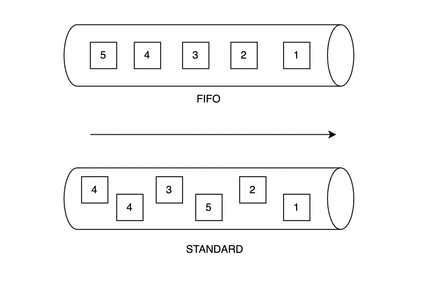

# SQS Training

SQS is a managed message queuing service used to send, store and retrieve multiple messages of various sizes asynchronously.

It provides an HTTP API through which items can be submitted to and readout of a queue by apps. AWS fully manages the queue itself, making SQS an easy solution for passing messages between different components of software systems running in the cloud.


There are two type of queues FIFO and Standard:




### Parameters of a queue in Amazon:

Message retention period – The amount of time that Amazon SQS retains messages that remain in the queue. By default, the queue retains messages for four days. You can configure a queue to retain messages for up to 14 days. For more information, see Message retention period.

Delivery delay – The amount of time that Amazon SQS will delay before delivering a message that is added to the queue. For more information, see Delivery delay.

Receive message wait time – The maximum amount of time that Amazon SQS waits for messages to become available after the queue gets a receive request. For more information, see Amazon SQS short and long polling.


ApproximateReceiveCount – Returns the number of times a message has been received across all queues but not deleted.


By default the maximum number of messages in a poll is 10. if we don't specify a task executor, they will be processed in
10 different threads.
When we define a CorePoolSize of 3 for example, 1  thread will be used to poll and the other 2 will be used to process the messages
The QueueCapacity of a task executor means the number of messages that will be waiting as a maximum meanwhile we are waiting that a
thread is free again.


https://www.javatpoint.com/aws-sqs

It's necessary to define retries policy and discard policy

References

https://medium.com/@anujpatel2809/spring-boot-with-sqs-localstack-46b3b8c79e80


https://www.javacodexamples.com/examples/how-to-obtain-approximatereceivecount-from-an-sqs-message


https://medium.com/bancolombia-tech/desarrolla-local-con-los-servicios-de-aws-usando-localstack-2928012b167e

https://us.wantedly.com/companies/bebit/post_articles/317492

https://stackoverflow.com/questions/51373082/springboot-sqslistener-not-working-with-exception-taskrejectedexception


## Commands

```aws --endpoint-url=http://localhost:4566 sqs create-queue --queue-name test-queue.fifo --attributes FifoQueue=true```

```aws sqs set-queue-attributes --queue-url http://localhost:4566/000000000000/not-fifo-queue --attributes DelaySeconds=300```
